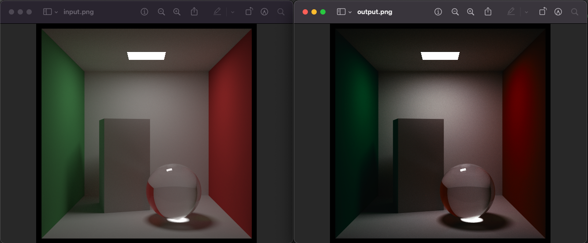

# Gube


A golang library to use [.cube LUT](https://en.wikipedia.org/wiki/3D_lookup_table) files used for [colour grading](https://en.wikipedia.org/wiki/Color_grading).

## Usage

Once a Gube instance has been created, you can call `LookUp` for each RGB value, as done in the [Izpi path tracer](https://gitlab.com/flynn-nrg/izpi) colour grading code:

```go
func (cg *ColourGrading) Apply(i image.Image, cam *camera.Camera) error {
	im, ok := i.(*floatimage.FloatNRGBA)
	if !ok {
		return errors.New("only FloatNRGBA image format is supported")
	}
	for y := i.Bounds().Min.Y; y < i.Bounds().Max.Y; y++ {
		for x := i.Bounds().Min.X; x < i.Bounds().Max.X; x++ {
			pixel := im.FloatNRGBAAt(x, y)
			rgb, err := cg.g.LookUp(pixel.R, pixel.G, pixel.B)
			if err != nil {
				return err
			}
			im.Set(x, y, colour.FloatNRGBA{
				R: rgb[0],
				G: rgb[1],
				B: rgb[2],
				A: pixel.A})
		}
	}

	return nil
}
```

A convenience `ProcessImage` method is also provided that will apply a LUT to an image and return a copy of the image with the changes.

Example:

```go
package main

import (
	"image/png"
	"log"
	"os"

	"github.com/flynn-nrg/gube/gube"
)

func main() {
	imageIn, err := os.Open("input.png")
	if err != nil {
		log.Fatal(err)
	}
	input, err := png.Decode(imageIn)

	cube, err := os.Open("Rec709_Kodak_2393_D65.cube")
	if err != nil {
		log.Fatal(err)
	}

	gb, err := gube.NewFromReader(cube)
	if err != nil {
		log.Fatal(err)
	}

	outImage, err := gb.ProcessImage(input)
	if err != nil {
		log.Fatal(err)
	}

	outFile, err := os.Create("output.png")
	if err != nil {
		log.Fatal(err)
	}

	err = png.Encode(outFile, outImage)
	if err != nil {
		log.Fatal(err)
	}
}
```

Which will yield this result:


